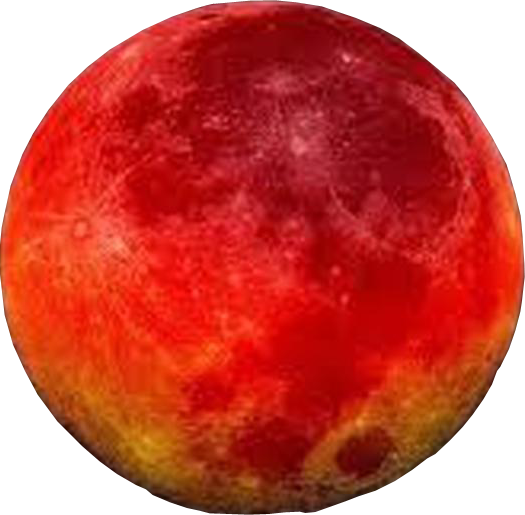

# Project-5

# App Usage:
Mars Colony App was created to identify and report sightings of known alien creatures and create a documented list accessible by all colonists in order to keep track of the alien threat.  (The colonists of Mars are obviously not aware of the irony behind calling the native creatures aliens)

# Project Info
This repository contains the Mars Colony App - a project assigned by Red Academy.

# Technologies Used in This Project
Sass/css    Angular   Typescript/javascript    Postman   API   JSON    Github    HTTP requests    ngAnimations

# App Directions
Welcome to Mars!  Use this app to register yourself as the newest colonist to the Martian colony.  Check out the alien sightings in your area and on Mars as a whole.  Have you encountered an alien, yourself?  Then report your encounter so the matter can be dealt with in the most bureaucratic way possible!

# Learnings
This project was a great exercise in Getting and Posting APIs and implementing my knowledge of css obtained in this course in a creative way.

I learned a lot about typescript and the different things it can do in conjunction with Angular.

# Instructions
Clone this repository to your computer, make sure in your terminal you are navigated inside the angular2-project directory and run npm install, making sure all relevant node modules are installed.  Afterwards,  run 'ng serve' then follow the link to the local server hosting the site.

# Contributors
Camden Shaw